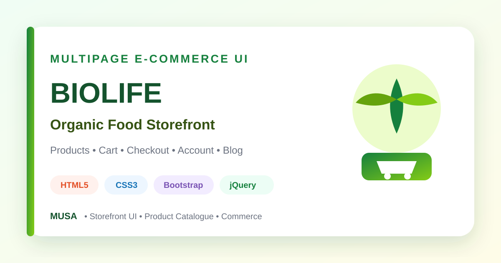

<div align="center">



# Biolife — Organic Food E-Commerce Front End

### A comprehensive multipage organic-food storefront interface with product catalogues, cart and checkout pages, account screens, blog layouts, and responsive components.


[](https://github.com/samusa099)
[](https://developer.mozilla.org/docs/Web/HTML)
[](https://developer.mozilla.org/docs/Web/CSS)
[](https://getbootstrap.com/)
[](https://developer.mozilla.org/docs/Web/JavaScript)

[](https://github.com/samusa099/Biolife-Organic-Food-Ecommerce)
[](https://github.com/samusa099/Biolife-Organic-Food-Ecommerce)
[](https://github.com/samusa099/Biolife-Organic-Food-Ecommerce/commits/main)

</div>

---

## 📌 Overview

A large e-commerce front-end containing multiple home layouts, catalogue views, product presentations, cart, checkout, login, blog, contact, selectors, sliders, and reusable storefront assets.

## 📚 Documentation

| Resource | Description |
|---|---|
| [**HOW_TO_USE.md**](HOW_TO_USE.md) | Detailed page map plus customisation, cleanup, backend, security, and deployment guidance |
| [**Repository Cover**](assets/repository-cover.svg) | Scalable professional cover used in this README |

## ✨ Key Features

- Multiple home and catalogue layouts
- Mega menu and responsive navigation
- Product grids, lists, and detail views
- Shopping cart and checkout interfaces
- Login, contact, blog, and 404 pages
- Sliders, selectors, animations, and reusable assets

## 🗂️ Repository Structure

```text
Biolife-Organic-Food-Ecommerce/
├── index.html
├── index-2.html
├── home-*.html
├── category-*.html
├── shopping-cart.html
├── checkout.html
├── assets/
│   ├── css/
│   ├── js/
│   ├── images/
│   └── repository-cover.svg
├── HOW_TO_USE.md
└── README.md
```

## 🚀 Run Locally

```bash
git clone https://github.com/samusa099/Biolife-Organic-Food-Ecommerce.git
cd Biolife-Organic-Food-Ecommerce
```

Open `index.html` or `index-2.html` with **VS Code Live Server**.

> Authentication, inventory, payment, order processing, and customer-data handling are not implemented.

## 👤 Author

<div align="center">

### Musa

**Internationally certified HR professional and data analytics practitioner from Bangladesh.**  
Musa combines people operations, Excel, Power BI, SQL, and technology-driven problem-solving to build practical, structured, and user-focused projects.

[](https://github.com/samusa099)

</div>
